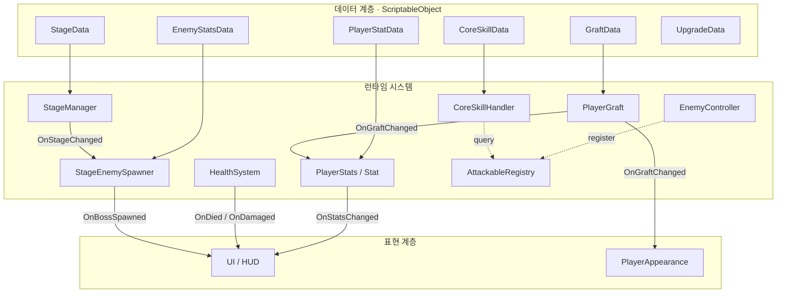

# ANOMALY

> 생체공포(body-horror) 컨셉의 Unity 모바일 방치형 RPG.
> 이식(Graft) 장비로 캐릭터의 능력과 외형이 변이하며, 챕터(C01~C10)를 따라 점점 깊은 격리 구역으로 내려간다.

Unity · C# · 모바일(Android) · ScriptableObject 데이터 드리븐 설계

---

## 한눈에 보기

- **71개 스크립트 / 약 5,600줄** 규모의 단일 개발 프로젝트
- **데이터 드리븐 설계** — 밸런스/콘텐츠를 8종 ScriptableObject로 분리, 코드 수정 없이 챕터·스탯·드랍·스킬 조정
- **이벤트 주도 아키텍처** — 20개 이벤트로 시스템 간 느슨한 결합 (UI는 상태를 폴링하지 않고 구독)
- **State 패턴** 기반 플레이어 행동 제어 (Idle / MoveForward / Chase / Attack / Dead)
- **인터페이스 + 레지스트리**로 적 탐색 추상화 → `FindObjectOfType` 핫패스 제거, GC 절감

---

## 아키텍처



**계층 분리 원칙**
- 데이터(SO)는 로직을 모른다 — 순수 값/설정만 보유
- 런타임 시스템은 SO를 주입받아 동작하고, 결과를 이벤트로 발행
- 표현 계층(UI/외형)은 이벤트를 구독만 한다 — 게임 로직을 갖지 않음

---

## 핵심 시스템 하이라이트

### 1. 스탯 모디파이어 시스템 (`Stat.cs`, `StatModifier.cs`)
장비/업그레이드가 스탯에 영향을 주는 구조를 RPG 표준 패턴으로 구현.

- **3단계 연산** — Flat(고정) → PercentAdd(합연산 %) → PercentMult(곱연산 %) 순서 보장
- **dirty flag 캐싱** — 값이 바뀔 때만 재계산, 매 프레임 연산 방지
- **source 기반 제거** — 어떤 장비가 부여한 모디파이어인지 추적해, 해제 시 정확히 그 출처의 것만 제거

```csharp
// PercentAdd는 모아서 한 번에 곱하고, PercentMult는 개별로 곱한다
if (mod.type == ModifierType.PercentAdd) {
    sumPercentAdd += mod.value;
    if (다음_모디파이어가_PercentAdd가_아니면)
        finalValue *= (1f + sumPercentAdd);
}
```

### 2. 적 탐색 추상화 (`IAttackable`, `AttackableRegistry.cs`)
매 프레임 `FindObjectOfType`로 적을 찾는 대신, 등록/해제 기반 레지스트리로 전환.

- 적은 생성 시 레지스트리에 **등록**, 사망/파괴 시 **해제**
- 범위 탐색은 **캐시 리스트 재사용**(`Clear()` 후 채움)으로 GC 할당 회피
- 5초 주기로 null/dead 유닛 일괄 정리

### 3. 데이터 드리븐 스테이지 (`StageData`, `StageManager`, `StageEnemySpawner`)
챕터 10개가 전부 ScriptableObject. 스포너는 `StageManager.OnStageChanged`를 **구독**해 자동 갱신 — 스테이지 전환 로직과 스폰 로직이 직접 결합하지 않는다.

### 4. 이식 시스템 (`PlayerGraft.cs`)
5개 슬롯(Head/Core/ArmL/ArmR/Legs)에 Graft 장착. 장착/해제 시 모디파이어를 대칭적으로 적용/제거하고, Core 슬롯은 외형(`PlayerAppearance`)과 액티브 스킬(`CoreSkillHandler`)까지 연동.

---

## 기술 스택 / 폴더 구조

```
Assets/Scripts/
├── Enemy/         적 행동·모션·스폰 (코드 기반 의사 애니메이션)
├── Player/        플레이어 컨트롤·스탯·외형
│   ├── State/     State 패턴 (Idle/Move/Chase/Attack/Dead)
│   ├── Stat/      스탯 + 모디파이어
│   ├── Equipment/ 이식(Graft) 장착 관리
│   └── Data/      PlayerStatData (SO) + 런타임
├── Stage/         스테이지 진행·스폰·맵 스크롤
├── Graft/         이식 데이터·합성·추출
├── Save/          JSON 직렬화 세이브
├── UI/            HUD·인벤토리·가챠·합성·업그레이드
├── Managers/      사운드·광고
└── Interfaces/    IAttackable 등
```

---

## 출시 대응 현황

| 영역 | 상태 |
|------|------|
| 광고 (AdMob) | 보상형 광고 연동 |
| 설정 (사운드/옵션) | 구현 완료 |
| 로컬 세이브 | JSON 직렬화, 구현 완료 |
| 클라우드 세이브 / 소셜 로그인 | 세이브 백엔드 교체로 확장 가능한 구조 |
| IAP 결제 | 설계 반영, 미구현 |

---

## 개발 노트

설계 판단의 근거와 버그 수정 이력은 개발 로그에 누적 기록.
주요 의사결정 예: Animator 대신 코드 기반 모션 채택, 부위별 스프라이트 → 측면 본 리그 전환,
StageData ↔ Spawner 직접 결합 해제.
